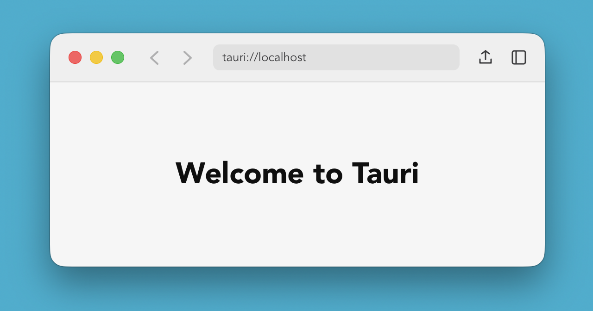

# etude-tauri-mac-unified-toolbar

A personal study project exploring whether [Tauri](https://tauri.app/) can render a native-feeling macOS unified toolbar (Safari/Finder style) on top of a webview.

## About

This is an etude — a hands-on exercise, not a product. The question was whether a macOS-native-looking unified toolbar (a single translucent vibrancy surface that embeds the traffic lights and the toolbar controls together, the way Safari and Finder do) could be reproduced in Tauri 2 without dropping down to custom Swift code. This project is the recorded answer, along with the small set of configuration knobs needed to make it work.

## Features

- A unified 52px header surface that hosts the traffic lights, back/forward buttons, a centered address-bar-style field, and share/sidebar buttons — visually one piece, like Safari.
- Translucent vibrancy background that picks up the desktop tint behind the window.
- The whole header is a window drag region; the buttons inside remain clickable.
- Light and dark appearance follow the system setting automatically.

## Implementation Notes

- **Window configuration** in [src-tauri/tauri.conf.json](src-tauri/tauri.conf.json) — `titleBarStyle: "Overlay"`, `hiddenTitle: true`, and `transparent: true` produce a borderless, fully transparent window, while `trafficLightPosition: { x: 20, y: 28 }` shifts the traffic lights down so they sit vertically centered inside the 52px toolbar. The `y: 28` value was tuned empirically against the 52px toolbar height — if you change the toolbar height, this needs to be re-tuned alongside `--toolbar-height` in [src/styles.css](src/styles.css) and `TOOLBAR_HEIGHT` in [src-tauri/src/lib.rs](src-tauri/src/lib.rs). `macOSPrivateApi: true` is required to enable window transparency.
- **Native vibrancy via `window-vibrancy`** in [src-tauri/src/lib.rs](src-tauri/src/lib.rs) — on macOS, `apply_vibrancy` with `NSVisualEffectMaterial::HeaderView` and `NSVisualEffectState::Active` installs a real `NSVisualEffectView` behind the webview, which is what gives the toolbar genuine system vibrancy rather than a CSS-only approximation. The `macos-private-api` feature on the `tauri` crate in [src-tauri/Cargo.toml](src-tauri/Cargo.toml) is what unlocks this path.
- **Drag region** in [index.html](index.html) — `data-tauri-drag-region` on the `<header>` and its inner wrappers turns the empty parts of the toolbar into a window drag handle, while `<button>` children stay interactive without any extra opt-out.
- **CSS layout** in [src/styles.css](src/styles.css) — the toolbar is a fixed-position 52px bar with left padding equal to a `--traffic-light-width` (96px) so its contents never overlap the traffic lights. A semi-transparent fill plus `backdrop-filter: blur(20px) saturate(180%)` is layered on top of the native vibrancy, so the look stays reasonable even on platforms where the `NSVisualEffectView` path is unavailable. Dark-mode adjustments live alongside the light-mode rules via `@media (prefers-color-scheme: dark)`. `overscroll-behavior: none` on the `html` element suppresses the macOS rubber-band scroll bounce that the WebView would otherwise show when content is scrolled past its edges — without it the window bounces in a way that breaks the native-app illusion.

## License

[MIT](LICENSE)
